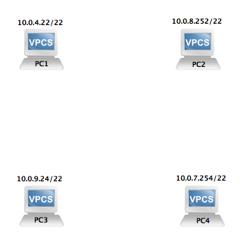

###Zadanie###




- Ustalic do jakich sieci naleza hosty PC1-PC4. Podac zakres adresow tych sieci oraz adres rozgloszeniowy. Naniesc te dane na diagram sieci.
- Polaczyc hosty nalezace do tych samych sieci za pomoca switchow.
- Sprawdzic komunikacje pomiedzy hostami w obu sieciach korzystajac z protokolu ICMP.
- Polaczyc switche za pomoca dwoch routerow Cisco c3725.
- Skonfigurowac statyczne tablice routingu routerow, tak aby mozliwa byla komunikacja pomiedzy sieciami. 
- Wyznaczyc adresy MAC hostow. Naniesc je na diagram sieci.

__Uwaga:__
- Projekt sieci zapisac jako: kolokwium-1-nazwisko
- W razie potrzeby obraz systemu operacyjnego routera c3725 pobrac poprzez polecenie:
```bash
scp unixman@155.158.206.23:/home/unixman/cisco/c3725-new.bin ~
```
- Po rozwiazaniu zadania upewnic sie czy ustawienia VPCS-ow oraz routerow sa zapisane
- Usunac plik z rozszerzeniem .ghost z katalogu kolokwium-1-nazwisko/project-files/dynamips
- Spakowac katalog projektu do formatu .tar.gz 
- Rozwiazanie zadania wyslac mailem na adres tomek.jelinski@gmail.com 
